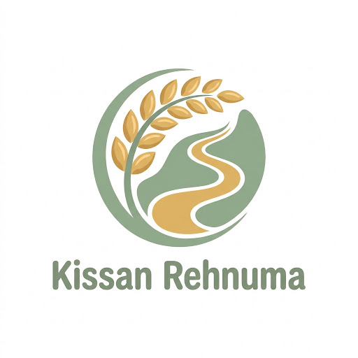

<p align="center">
  
</p>

<h1 align="center">Kissan Rehnuma</h1>

<p align="center">
  <strong>کسان رہنما — Farmer's Guide</strong><br/>
  AI-Powered Agricultural Assistance Platform for Pakistani Farmers
</p>

<p align="center">
  
  
  
  
  
  
</p>

---

## Overview

**Kissan Rehnuma** is a full-stack AI platform that helps Pakistani farmers diagnose crop and animal diseases from images, receive weather-based agricultural alerts, check real-time market prices, and access an AI voice helpline — all in Urdu/Roman Urdu.

Built as a **microservices system** with an API Gateway, each feature runs as an independent FastAPI service ensuring fault isolation and independent scalability. The frontend is a single React Native (Expo) codebase targeting both mobile and web.

---

## Features

| Feature | Description | Service |
|---------|-------------|---------|
| **Crop Disease Detection** | Upload leaf image → AI detects disease, symptoms, treatment plan | `crop-disease-service` |
| **Animal Disease Diagnosis** | Upload animal image → AI identifies disease, recommends vet doctor | `animal-disease-service` |
| **Weather Alerts** | Location-based weather monitoring with AI risk assessment & advisories | `weather-alert-service` |
| **Market Rates** | Real-time mandi prices from 36 Punjab markets, 47+ commodities | `market-rate-service` |
| **AI Voice Helpline** | LiveKit-based voice agent answering farmer queries in Urdu | `voice-agent-service` |
| **User Authentication** | Farmer registration, JWT auth, OTP email verification | `user-auth-service` |

---

## Architecture

```
┌──────────────────────────────────────────────────────────────────┐
│                    FARMER  (Mobile / Web Browser)                 │
│                   React Native (Expo) App                         │
└─────────────────────────────┬────────────────────────────────────┘
                              │ HTTPS
                              ▼
┌──────────────────────────────────────────────────────────────────┐
│                         API GATEWAY                                │
│   JWT Auth  ·  Rate Limiting  ·  Circuit Breaker  ·  CORS        │
└──┬──────────┬──────────┬──────────┬──────────┬───────────────────┘
   │          │          │          │          │
   ▼          ▼          ▼          ▼          ▼
┌──────┐ ┌──────┐ ┌────────┐ ┌────────┐ ┌─────────┐
│ Auth │ │ Crop │ │ Animal │ │Weather │ │ Market  │
│ Svc  │ │ Svc  │ │  Svc   │ │  Svc   │ │  Svc    │
└──┬───┘ └──┬───┘ └───┬────┘ └───┬────┘ └───┬─────┘
   │        │         │          │           │
   └────────┴─────────┴──────────┴───────────┘
              PostgreSQL (Neon)
```

### Service Communication

The API Gateway is the **single entry point** for the frontend. It handles:

- **JWT Validation** on every request before proxying
- **Circuit Breaker** — if one service fails, others continue working
- **Rate Limiting** — per-IP request throttling (60 req/min)
- **Error Isolation** — one service down returns graceful error, doesn't crash the gateway
- **Structured Logging** via structlog with correlation IDs

---

## Tech Stack

| Layer | Technology |
|-------|-----------|
| **Backend** | Python 3.12 · FastAPI · Uvicorn (async) |
| **Agentic AI** | LangGraph · LangChain · OpenRouter (Gemini) |
| **Database** | PostgreSQL 16 (Neon) · SQLAlchemy 2.0 · Alembic |
| **Vision AI** | Provider pattern (OpenRouter Vision API → swappable) |
| **Voice** | LiveKit WebRTC · Uplift AI (STT/TTS) |
| **Weather** | Open-Meteo API (free, no key) · LLM advisory generation |
| **Market Data** | AMIS Punjab scraper · BeautifulSoup4 · Redis caching |
| **Frontend** | React Native (Expo SDK 57) · TypeScript · Material Design 3 |
| **Deployment** | Render.com (backend) · Vercel (frontend) · Neon (database) |
| **Observability** | LangSmith tracing · structlog |

---

## Project Structure

```
Kissan_Rehnuma/
├── api-gateway/                    # FastAPI gateway — routing, auth, resilience
├── services/
│   ├── user-auth-service/          # Registration, login, JWT, OTP
│   ├── crop-disease-service/       # Vision AI → LangGraph → diagnosis
│   ├── animal-disease-service/     # Vision AI → LangGraph → vet matching
│   ├── weather-alert-service/      # Open-Meteo → risk analysis → alerts
│   ├── market-rate-service/        # AMIS scraper → price engine
│   └── voice-agent-service/        # LiveKit → STT → LLM → TTS pipeline
├── mobile-web-app/                 # Expo React Native (mobile + web)
├── shared/                         # Internal shared Python utilities
├── infra/                          # Kubernetes manifests, Docker, CI/CD
├── docs/                           # Architecture docs, API specs, ADRs
├── render.yaml                     # Render Blueprint (IaC deployment)
└── scripts/                        # Setup, deploy, DB automation
```

Each microservice follows a consistent internal layout:

```
service/
├── app/
│   ├── main.py                     # FastAPI entrypoint + lifespan
│   ├── api/v1/endpoints/           # Route handlers
│   ├── core/                       # Config, logging, security
│   ├── agents/                     # LangGraph state graphs + prompts
│   ├── models/                     # SQLAlchemy ORM models
│   ├── schemas/                    # Pydantic request/response schemas
│   ├── services/                   # Business logic
│   └── repositories/               # Data access layer
├── alembic/versions/               # Database migrations
├── tests/                          # Unit + integration tests
├── Dockerfile                      # Container build
└── requirements.txt / pyproject.toml
```

---

## Getting Started

### Prerequisites

- **Python** 3.12+
- **Node.js** 18+ / npm
- **PostgreSQL** 16 (or use Neon free tier)
- **Docker** (optional, for containerized development)

### Backend Services

```bash
# 1. Clone the repository
git clone https://github.com/muzaffar401/Kissan_Rehnuma.git
cd Kissan_Rehnuma

# 2. For each service, install dependencies and run:
cd api-gateway
pip install -r requirements.txt
uvicorn app.main:app --host 0.0.0.0 --port 3000

# Repeat for each service on its designated port:
#   user-auth:       port 8002
#   crop-disease:    port 8001
#   animal-disease:  port 8003
#   weather-alert:   port 8004
#   market-rate:     port 8005
```

### Frontend (Web)

```bash
cd mobile-web-app
npm install
npx expo start --web
# Opens at http://localhost:8081
```

### Environment Variables

Each service requires a `.env` file at its root. Key variables:

| Variable | Description |
|----------|-------------|
| `DATABASE_URL` | PostgreSQL connection string |
| `JWT_SECRET_KEY` | Shared JWT secret (must match across auth services) |
| `OPENROUTER_API_KEY` | Vision LLM API key for disease detection |
| `CLOUDINARY_*` | Image storage credentials |
| `APP_ENV` | `development` or `production` |

---

## Deployment

Kissan Rehnuma deploys on **100% free tier** infrastructure (no credit card required):

| Component | Platform | Details |
|-----------|----------|---------|
| **Backend (6 services)** | [Render.com](https://render.com) | Free tier, 512MB each, auto-scales to zero |
| **Database** | [Neon](https://neon.tech) | Free Postgres, 0.5GB, never expires |
| **Frontend** | [Vercel](https://vercel.com) | Hobby plan, Expo static web export |

### One-Click Deploy (Render Blueprint)

This repository includes a [`render.yaml`](render.yaml) Blueprint file. To deploy:

1. Create 3 databases in [Neon](https://console.neon.tech): `neondb`, `kissan_crop_disease`, `kissan_animal_disease`
2. Push this repo to GitHub
3. Go to [Render Dashboard](https://dashboard.render.com) → **New → Blueprint** → connect your repo
4. Fill in the prompted environment variables (API keys, DB connection strings)
5. Click **Apply** — all 6 services deploy automatically

### Frontend Deployment

```bash
cd mobile-web-app
npx expo export -p web     # Static export to dist/
# Deploy dist/ to Vercel
```

---

## Design Decisions

| Decision | Rationale |
|----------|-----------|
| **Provider abstraction for CV models** | Cloud Vision API for MVP → swap to fine-tuned EfficientNet when Pakistani dataset is available. Research shows lab-trained models degrade on real-world field images. |
| **pgvector over standalone vector DB** | Single PostgreSQL instance for relational + vector data. Supports hybrid SQL + similarity queries. No extra infrastructure. |
| **LangGraph over plain LangChain** | Disease diagnosis is multi-step (detect → validate → retrieve → generate). LangGraph provides explicit stateful workflow management with conditional branching. |
| **Confidence gate pattern** | Never trust low-confidence predictions. CV model diagnoses, confidence gate validates (≥70%), RAG retrieves verified knowledge, LLM only *explains* in farmer-friendly language. |
| **LLM explains, never diagnoses** | LLMs hallucinate. CV models are trained for visual classification. RAG ensures treatments come from verified agricultural knowledge, not LLM memory. |
| **Microservices over monolith** | Fault isolation (weather service crash ≠ crop service crash), independent scaling, separate databases per domain. |

---

## Project Status

| Component | Status |
|-----------|--------|
| API Gateway | ✅ Complete — routing, JWT, circuit breaker, rate limiting, CORS |
| User Auth Service | ✅ Complete — signup, login, OTP, JWT, farmer profile |
| Crop Disease Service | ✅ Complete — LangGraph agent, vision AI, pgvector RAG, treatment plans |
| Animal Disease Service | ✅ Complete — LangGraph agent, vision AI, pgvector RAG, vet matching |
| Weather Alert Service | ✅ Complete — Open-Meteo, LLM advisory, multi-layer caching, background scheduler |
| Market Rate Service | ✅ Complete — AMIS scraper, 47 commodities, 36 mandis, Redis caching |
| Voice Agent Service | ✅ Complete — LiveKit WebRTC, STT/TTS pipeline, tool-calling agent |
| Mobile/Web Frontend | ✅ Complete — 13 screens, dark mode, Material Design 3, bilingual (Urdu/English) |
| Deployment Config | ✅ Complete — Render Blueprint, Neon Postgres, Vercel frontend |

---

## License

This project is built for the **Qoder Hackathon**.

---

<p align="center">
  <strong>Kissan Rehnuma — ہر کسان کا اپنا رہنما</strong><br/>
  <em>Empowering farmers with AI, one crop at a time.</em>
</p>
