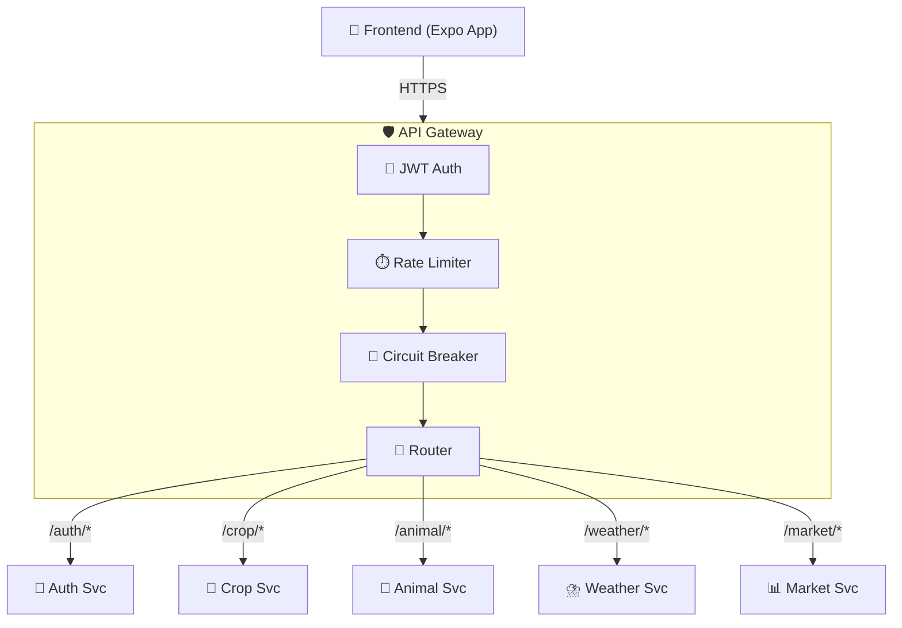

<h1 align="center">API Gateway</h1>

<p align="center">
  Single entry point for all frontend requests — routing, JWT validation, rate limiting, and circuit breaking
</p>

<p align="center">
  
  
  
</p>

---

## Overview

The API Gateway is the **single entry point** for the Kissan Rehnuma frontend. It receives all HTTP requests, validates JWT tokens, enforces rate limits, and proxies to the appropriate microservice. If a downstream service is down, the circuit breaker returns a graceful error while other routes continue working.

---

## Architecture



---

## Features

| Feature | Implementation |
|---------|---------------|
| **JWT Validation** | Validates token on every request before proxying |
| **Rate Limiting** | 60 req/min per IP via `slowapi` |
| **Circuit Breaker** | Per-service breakers via `pybreaker` — CLOSED/OPEN/HALF-OPEN states |
| **Reverse Proxy** | Async HTTP proxy via `httpx.AsyncClient` with connection pooling |
| **CORS** | Configurable origins (supports web + mobile LAN access) |
| **Structured Logging** | `structlog` with correlation IDs for request tracing |
| **Health Checks** | `/health` endpoint + per-service circuit breaker status |
| **API Docs** | Swagger UI at `/docs` (debug mode only) |

---

## API Routes

| Path Pattern | Proxied To | Auth Required |
|-------------|------------|---------------|
| `/api/v1/auth/*` | user-auth-service | No (login/signup) |
| `/api/v1/crop/*` | crop-disease-service | Yes (JWT) |
| `/api/v1/animal/*` | animal-disease-service | Yes (JWT) |
| `/api/v1/weather/*` | weather-alert-service | Yes (JWT) |
| `/api/v1/market/*` | market-rate-service | Yes (JWT) |
| `/health` | — (gateway itself) | No |
| `/circuit-breakers` | — (gateway itself) | No |

---

## Environment Variables

| Variable | Required | Default | Description |
|----------|----------|---------|-------------|
| `PORT` | No | `3000` | Gateway port |
| `JWT_SECRET_KEY` | Yes | — | Must match user-auth-service |
| `CORS_ORIGINS` | No | `http://localhost:8081,...` | Comma-separated allowed origins |
| `RATE_LIMIT_PER_MINUTE` | No | `60` | Max requests per IP per minute |
| `CROP_DISEASE_SERVICE_URL` | Yes | — | Crop service URL |
| `USER_AUTH_SERVICE_URL` | Yes | — | Auth service URL |
| `ANIMAL_DISEASE_SERVICE_URL` | Yes | — | Animal service URL |
| `WEATHER_ALERT_SERVICE_URL` | Yes | — | Weather service URL |
| `MARKET_RATE_SERVICE_URL` | Yes | — | Market service URL |
| `DEBUG` | No | `true` | Enables `/docs` and `/redoc` |
| `APP_ENV` | No | `development` | `development` or `production` |

---

## Quick Start

```bash
cd api-gateway

pip install -r requirements.txt

# Configure .env with service URLs and JWT secret

uvicorn app.main:app --host 0.0.0.0 --port 3000
```

Gateway available at `http://localhost:3000`

---

## Circuit Breaker

The gateway uses a per-service circuit breaker pattern:

| State | Behavior |
|-------|----------|
| **CLOSED** | Normal — requests forwarded to service |
| **OPEN** | Service failing — return fallback error immediately |
| **HALF-OPEN** | Periodically test if service recovered |

Check breaker status: `GET /circuit-breakers`

---

## Tech Stack

- **Framework:** FastAPI + Uvicorn
- **HTTP Proxy:** httpx (async, connection pooling)
- **Rate Limiting:** slowapi
- **Circuit Breaker:** pybreaker
- **Logging:** structlog
- **Config:** pydantic-settings (auto-loads from env)
