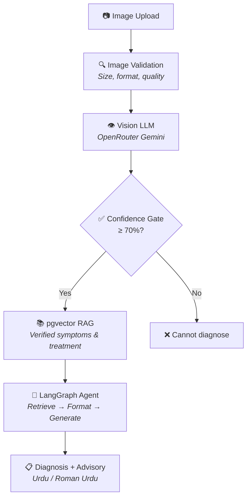

<h1 align="center">Crop Disease Service</h1>

<p align="center">
  AI-powered crop disease detection from leaf images using Vision LLM + LangGraph + RAG
</p>

<p align="center">
  
  
  
  
</p>

---

## Overview

The Crop Disease Service detects diseases from crop leaf images. A Vision LLM (Gemini via OpenRouter) analyzes the image, a confidence gate validates the prediction (≥70%), pgvector RAG retrieves verified disease knowledge, and the LLM generates a farmer-friendly diagnosis with symptoms, treatment, and preventive measures — all in a single LangGraph stateful workflow.

The LLM **never diagnoses** — it only explains verified diagnoses in farmer-friendly language. The CV model diagnoses, RAG provides verified knowledge, and the LLM translates.

---

## Architecture



---

## API Endpoints

| Method | Path | Auth | Description |
|--------|------|------|-------------|
| `POST` | `/api/v1/crop/detect` | JWT | Upload image → disease diagnosis + treatment plan |
| `GET` | `/api/v1/crop/history` | JWT | Past scan results for current farmer |
| `GET` | `/api/v1/crop/health` | No | Service health check |
| `GET` | `/test` | No | Browser-based test UI (debug mode only) |

---

## Environment Variables

| Variable | Required | Default | Description |
|----------|----------|---------|-------------|
| `DATABASE_URL` | Yes | — | PostgreSQL connection (`kissan_crop_disease` DB) |
| `OPENROUTER_API_KEY` | Yes (prod) | — | Vision LLM API key |
| `VISION_MODEL` | No | `google/gemini-2.5-flash` | Vision model for disease detection |
| `VISION_TEMPERATURE` | No | `0.1` | Low temp for consistent diagnoses |
| `VISION_MAX_TOKENS` | No | `2048` | Max tokens for vision response |
| `CONFIDENCE_THRESHOLD` | No | `0.70` | Minimum confidence to proceed |
| `CLOUDINARY_CLOUD_NAME` | Yes (prod) | — | Image storage |
| `CLOUDINARY_API_KEY` | Yes (prod) | — | Cloudinary credentials |
| `CLOUDINARY_API_SECRET` | Yes (prod) | — | |
| `CLOUDINARY_FOLDER` | No | `kissan-rehnuma/crop-scans` | Cloudinary upload folder |
| `LANGSMITH_TRACING` | No | `false` | Enable LangSmith observability |
| `APP_ENV` | No | `development` | `production` enforces required keys |

---

## Quick Start

```bash
cd services/crop-disease-service

# Install dependencies (uv package manager)
uv sync

# Or with pip from pyproject.toml
pip install .

# Configure .env

# Start service
python -m uvicorn app.main:app --host 0.0.0.0 --port 8001
```

### Docker

```bash
docker build -t crop-disease-service .
docker run -p 8001:8001 --env-file .env crop-disease-service
```

Service available at `http://localhost:8001`

---

## Key Design Decisions

| Decision | Rationale |
|----------|-----------|
| **Single LLM call for vision** | Direct OpenRouter API instead of LangChain wrapper — lower latency, fewer abstractions |
| **Confidence gate at 70%** | Prevents hallucinated diagnoses from reaching the farmer |
| **Separate database** | Crop disease data (scans, diagnoses) is domain-specific; isolation prevents cross-service contamination |
| **Cloudinary for images** | CDN-backed image storage with auto-optimization; no local disk management |
| **Async SQLAlchemy + asyncpg** | Vision LLM calls are I/O-bound; async DB queries prevent thread blocking |
| **Docker with uv** | Multi-stage build keeps runtime image lean; uv for fast dependency resolution |

---

## Tech Stack

- **Framework:** FastAPI + Uvicorn (async)
- **AI Agent:** LangGraph (stateful workflow: detect → gate → RAG → explain)
- **Vision:** OpenRouter Vision API (Gemini)
- **RAG:** pgvector (PostgreSQL extension for vector similarity search)
- **Image Storage:** Cloudinary
- **ORM:** SQLAlchemy 2.0 (async)
- **Dependencies:** uv + pyproject.toml
- **Containerization:** Docker (multi-stage build)
- **Observability:** LangSmith tracing
