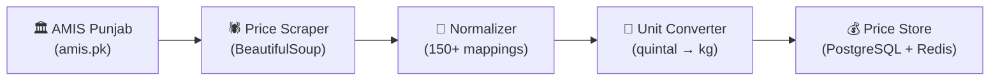

<h1 align="center">Market Rate Service</h1>

<p align="center">
  Real-time crop prices from Pakistani mandis with automated daily price pipeline
</p>

<p align="center">
  
  
  
</p>

---

## Overview

The Market Rate Service provides real-time crop prices from Pakistani agricultural markets (mandis). It runs a daily automated pipeline that scrapes the AMIS Punjab price database, normalizes commodity names (150+ Punjabi/Urdu/English → standard mappings), converts units (Rs/100kg quintal → PKR/kg), and stores Min/Max/FQP (Fair Quality Price) for 47+ commodities across 36 Punjab mandis.

When Redis is available, prices are cached for fast reads. Without Redis, the service falls back to an in-process TTL cache.

---

## API Endpoints

| Method | Path | Auth | Description |
|--------|------|------|-------------|
| `GET` | `/api/v1/rates` | No | All latest prices (supports `?q=` search) |
| `GET` | `/api/v1/rates/trending` | No | Trending crops by price movement |
| `GET` | `/api/v1/rates/{crop}` | No | Prices for a specific crop across mandis |
| `POST` | `/api/v1/admin/ingest` | Admin Key | Trigger manual price ingestion pipeline |
| `GET` | `/` | No | Health check |

---

## Architecture



### Daily Pipeline

1. **Scrape** — Download `ViewPrices.aspx` from AMIS Punjab
2. **Parse** — Extract commodity, mandi, min/max/FQP prices
3. **Normalize** — Map Punjabi/Urdu names to standard English (e.g., "گندم" → "Wheat")
4. **Convert** — AMIS uses Rs/100kg (quintal) → convert to PKR/kg
5. **Store** — Upsert into prices table (dedup by mandi + crop + date)

---

## Environment Variables

| Variable | Required | Default | Description |
|----------|----------|---------|-------------|
| `DATABASE_URL` | Yes | — | PostgreSQL (shared Farmers DB) |
| `PORT` | No | `8005` | Service port |
| `REDIS_URL` | No | — | Redis for price caching (falls back to in-process) |
| `CACHE_TTL_SECONDS` | No | `7200` | Cache TTL (default: 2 hours) |
| `ADMIN_API_KEY` | Yes | — | Protects `/admin/*` endpoints |
| `AMIS_PRICES_URL` | No | `http://www.amis.pk/` | AMIS data source URL |
| `SCHEDULER_ENABLED` | No | `true` | Enable daily automated pipeline |
| `SCHEDULER_HOUR` | No | `7` | Hour to run pipeline (24h format) |
| `RUN_PIPELINE_ON_STARTUP` | No | `false` | Run ingestion once at startup |

---

## Quick Start

```bash
cd services/market-rate-service

pip install -r requirements.txt

# Configure .env (DATABASE_URL required)

alembic upgrade head
uvicorn app.main:app --host 0.0.0.0 --port 8005
```

Service available at `http://localhost:8005`

---

## Key Design Decisions

| Decision | Rationale |
|----------|-----------|
| **AMIS Punjab as primary source** | Government data, updated daily, covers 36 mandis with Min/Max/FQP |
| **Redis optional** | Graceful degradation to in-process TTL cache when Redis unavailable |
| **Unit conversion (quintal → kg)** | Farmers think in PKR/kg; AMIS reports in Rs/100kg |
| **150+ synonym mappings** | Pakistani markets use Punjabi, Urdu, and English crop names interchangeably |
| **Fuzzy matching (rapidfuzz)** | Handles spelling variations in AMIS data ("wheat" vs "Weat") |

---

## Tech Stack

- **Framework:** FastAPI + Uvicorn
- **ORM:** SQLAlchemy 2.0 (synchronous)
- **Scraper:** BeautifulSoup4 + httpx
- **Caching:** Redis (optional) with in-process fallback
- **Scheduling:** APScheduler (daily pipeline)
- **Text matching:** rapidfuzz (commodity name normalization)
