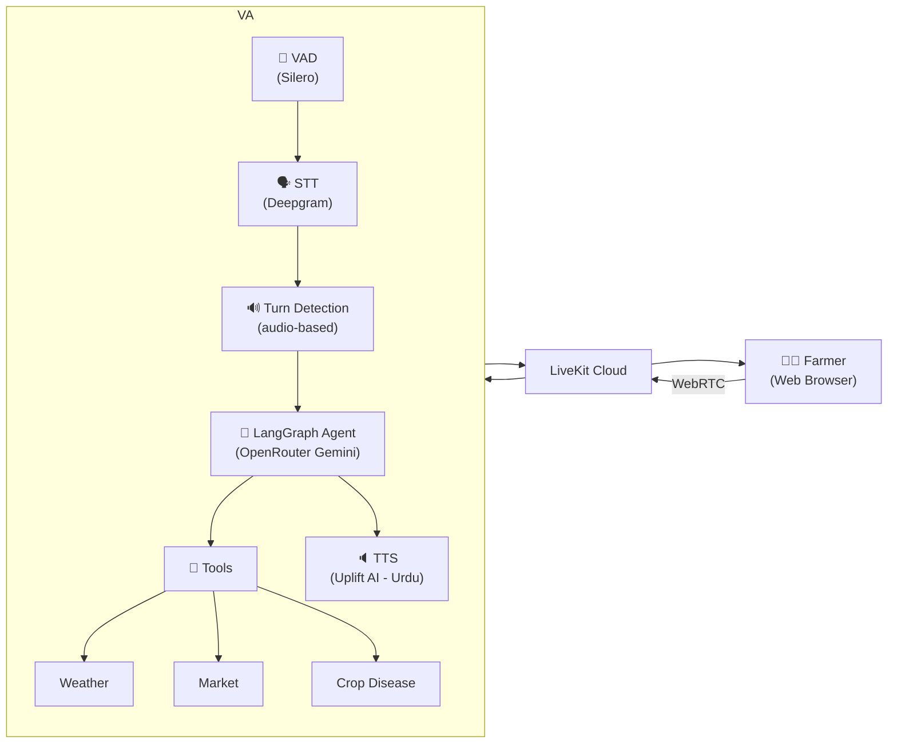

<h1 align="center">Voice Agent Service</h1>

<p align="center">
  AI voice helpline using LiveKit WebRTC with STT-LLM-TTS pipeline for Urdu-speaking farmers
</p>

<p align="center">
  
  
  
</p>

---

## Overview

The Voice Agent Service powers the AI voice helpline. When a farmer initiates a voice call through the web app, this service runs a real-time STT → LLM → TTS pipeline using LiveKit WebRTC. The LLM agent can query crop disease knowledge, check market rates, fetch weather data, or provide general agricultural advisory — all through natural Urdu conversation.

The agent uses **Urdu script output** for TTS (smoother voice quality) and **audio-based turn detection** with adaptive interruption handling.

---

## Architecture



### Pipeline Components

| Component | Provider | Purpose |
|-----------|----------|---------|
| **VAD** | Silero (local) | Voice Activity Detection — prewarmed at startup |
| **STT** | Deepgram | Speech-to-Text (Urdu) |
| **Turn Detection** | Audio-based | Detect when farmer stops speaking |
| **LLM** | OpenRouter (Gemini) | Understands problem, calls tools, generates response |
| **TTS** | Uplift AI | Text-to-Speech (Urdu voice) |

---

## Available Tools

| Tool | Description |
|------|-------------|
| `get_weather` | Fetch current weather for farmer's location |
| `get_market_rates` | Get latest mandi prices for a crop |
| `search_crop_disease` | Search crop disease knowledge base |
| `get_farmer_profile` | Retrieve farmer's profile information |

---

## Environment Variables

| Variable | Required | Description |
|----------|----------|-------------|
| `LIVEKIT_URL` | Yes | LiveKit Cloud WebSocket URL |
| `LIVEKIT_API_KEY` | Yes | LiveKit API key |
| `LIVEKIT_API_SECRET` | Yes | LiveKit API secret |
| `DEEPGRAM_API_KEY` | Yes | Speech-to-Text API key |
| `OPENROUTER_API_KEY` | Yes | LLM provider API key |
| `UPLIFT_API_KEY` | Yes | Uplift AI TTS API key (Urdu text-to-speech) |
| `DATABASE_URL` | Yes | PostgreSQL connection string |

---

## Quick Start

```bash
cd services/voice-agent-service

pip install -e .

# Configure .env with all API keys

# Run the agent worker
python -m app.main start

# Run the token server (for LiveKit JWT generation)
python token_server.py
```

Token server available at `http://localhost:8080`

---

## Key Design Decisions

| Decision | Rationale |
|----------|-----------|
| **LiveKit (not Twilio)** | WebRTC-based — lower latency, no phone network dependency, works on any browser |
| **Own STT-LLM-TTS pipeline** | Full control over each stage; swappable providers; no vendor lock-in |
| **Audio turn detection** | More natural conversation flow than VAD-only; handles interruptions gracefully |
| **Preemptive TTS generation** | Start generating audio while LLM is still producing text — reduces perceived latency |
| **Urdu script output** | LLM writes Urdu script → TTS produces smoother voice than Roman Urdu input |
| **VAD prewarming** | Silero model loaded at startup, not per-session — faster first turn |

---

## Latency Optimizations

| Optimization | Impact |
|-------------|--------|
| VAD prewarming at startup | Eliminates 200ms+ first-turn delay |
| Preemptive TTS generation | Audio starts before full LLM response |
| Urdu script for TTS | Better voice quality vs Roman Urdu |
| Audio turn detection | More accurate than energy-based; fewer false interrupts |

---

## Tech Stack

- **WebRTC:** LiveKit (cloud-hosted, room-based)
- **STT:** Deepgram (Urdu language support)
- **LLM:** OpenRouter (Gemini) with LangGraph tool-calling agent
- **TTS:** Uplift AI (Urdu text-to-speech)
- **VAD:** Silero (PyTorch, local inference)
- **Framework:** LiveKit Agents SDK (Python)
